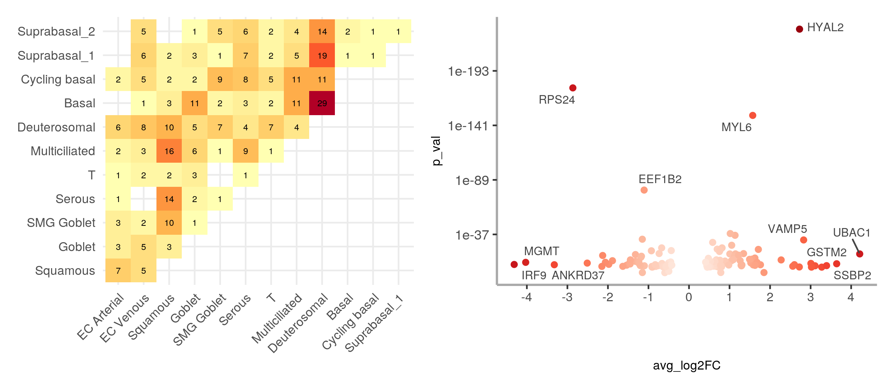

<!-- README.md is generated from README.Rmd. Please edit that file -->

# isoswitch

<!-- badges: start -->

<!-- badges: end -->

The goal of isoswitch is to facilitate the characterization of isoform
expression in long-read single-cell datasets. It includes a set of
functions and reports built on top of `Seurat`, `ggplot` and `rmarkdown`
that can be used to search, visualize and document isoform expression
patterns, and particularly isoform switches between cell identities.

## Installation

You can install the development version of isoswitch from
[GitHub](https://github.com/) with:

``` r
# install.packages("devtools")
devtools::install_github("atienza-ipmc/isoswitch")
```

## General Workflow

1.  Input data setup & pre-processing
2.  Isoform characterization
3.  Isoform switch detection
4.  Gene reports

Below is a short overview of the package functionality:

### 1 - Input data setup & pre-processing

Isoswitch is designed to work with `Seurat` objects with gene- and
isoform-level counts.

In particular, the ScNaUmi-seq protocol (Lebrigand et al 2020) generates
two  
count matrices that need to be loaded into respective Seurat assays
before starting the analysis, more specifically:

  - A gene-level \[gene x cell\] matrix count, generated by 10X
    CellRanger pipeline. Typically stored in assay “RNA” in Seurat
    object.
  - An isoform-level \[isoform x cell\] matrix count generated by
    SiCeLoRe pipeline, stored in a separate “isoform” assay.

> **Note**  
> isoswith expects the row names of the isoform count matrix to follow
> the format “\[gene\_name\]..\[transcript\_id\]”, example:
> “BCS1L..ENST00000359273”

``` r
head(rownames(seurat@assays$multi@counts))
#> [1] "BCS1L..ENST00000359273"   "PPP1R10..ENST00000461593"
#> [3] "OSBPL9..ENST00000428468"  "TEF..ENST00000406644"    
#> [5] "CBX5..ENST00000209875"    "TRAP1..ENST00000246957"
```

After loading up gene and isoform counts on the Seurat object, the
method `iso_preprocess()` prepares the isoform matrix by removing
low-expression transcripts as well as removing single-isoform genes
which are irrelevant for the isoform switch analysis.

The resulting “multi-isoform” matrix is stored as a new assay on the
input Seurat object.

``` r
seurat <- iso_preprocess(seurat, assay="ISO", new_assay="multi", filter_threshold=5)
```

### 2\. Isoform characterization

The method `iso_compute_stats()` parses the isoform raw count matrix
returning a data frame with stats on the expression of each transcript

  - `feature`, `gene_id`, `transcript_id` gene/transcript identifiers
  - `sum` Total UMI counts for the transcript
  - `total_gene` Total UMI counts for the gene
  - `n_isofs` Number of distinct isoforms detected for the gene
  - `max_sum` Max sum value for the isoform with the highest expression
  - `perc` Relative percentage of isoform UMI count vs gene total.
  - `is_major` (Boolean) is this considered a major isoform
  - `is_top` (Boolean) is this highest expressed isoform

<!-- end list -->

``` r
stats <- iso_compute_stats(seurat@assays$multi@counts) %>% arrange(gene_id)
head(stats, n=4)
#>                 feature gene_id   transcript_id sum total_gene n_isofs max_sum
#> 1 A1BG..ENST00000596924    A1BG ENST00000596924   5          8       2       5
#> 2 A1BG..ENST00000598345    A1BG ENST00000598345   3          8       2       5
#> 3  A2M..ENST00000495709     A2M ENST00000495709  10         14       2      10
#> 4  A2M..ENST00000318602     A2M ENST00000318602   4         14       2      10
#>       perc is_major is_top
#> 1 62.50000     TRUE   TRUE
#> 2 37.50000     TRUE  FALSE
#> 3 71.42857     TRUE   TRUE
#> 4 28.57143    FALSE  FALSE
```

The method `plot_assay_stats()` builds on this data to plot a summary
with number of genes, number of transcripts, distribution of isoforms
and number of genes per cell type that can be used to describe succintly
the isoform distribution in the dataset.

``` r
plot_assay_stats(seurat, "isoform")
```


### 3\. Isoform switch search

The term “isoform switch” refers to an event where two isoforms of the
same gene are considered markers of different clusters.

The marker search is implemented on the method `ISO_SWITCH_ALL()`. Any
extra parameters are passed on to the underlying Seurat’s FindMarkers
call to fine tune the search space.

``` r
clusters <- levels(seurat@active.ident)
switch_markers <- ISO_SWITCH_ALL(seurat, clusters, assay="isoform", 
                                 min.pct=0, logfc.threshold=0.40)
```

`ISO_SWITCH_ALL()` returns a data frame of transcripts identified as
markers of a given cluster for a given gene, one transcript per row.

To facilitate the graphical interpretation of the results:

  - `plot_marker_matrix()` produces a heatmap of number of unique genes
    per contrast between clusters  
  - `plot_marker_score()` produces a volcano plot showing p-values and
    average logFC for each gene with an isoform switch

<!-- end list -->

``` r
pl1 <- plot_marker_matrix(seurat, switch_markers) 
pl2 <- plot_marker_score(adult, switch_markers, facet=FALSE, overlaps=16)
pl1 | pl2 
```

 `plot_marker_score()` can
also plot individual volcano plots for each cluster analyzed with the
parameter facet=TRUE

``` r
plot_marker_score(adult, switch_markers, facet=TRUE, ncol=3)
```


The method `compute_switches()` and `gene_switch_table()` compute
isoform switchs from a list of markrs and return a data.frame and an
html table respectively (only compatible with html output documents such
as Rmd reports)

``` r
switches <- compute_switches(switch_markers)
gene_switch_table(switch_markers)
```

### 4\. Gene reports

After identifying genes of interest, twere are two ways of drilling down
and producing gene-level reports:

  - The `isoswitch_report()` method produces a compact plot of the gene.
    This function requires an extract from a gene annotation file and
    transcript metadata, documented [here](./README_metadata.md).

<!-- end list -->

``` r
isoswitch_report(seurat, "isoform", gene="HYAL2", marker_list=switch_markers, gtf_df, transcript_metadata) 
```


  - The `render_html_gene_report()` method renders an [html
    version](https://www.isomics.eu/reports/fetal/genes/C3_CD36.nb.html)
    of the report
